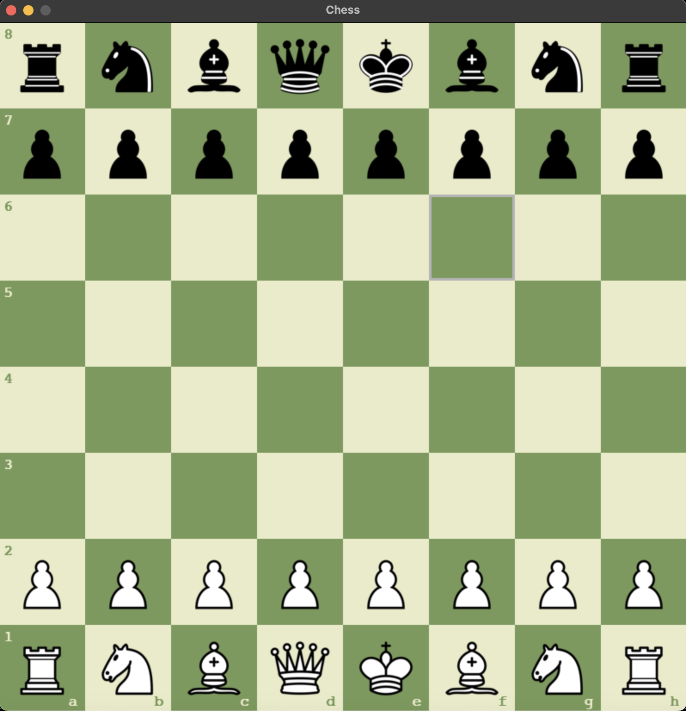

# Chess Game Instructions

- Entry point: main.py

- Press the "r" key to restart the game.

- Press the "t" key to change the board theme(green, blue, gray, brown).

If you find a bug Let me know! ENJOY!

# Game Snapshot - Start (green)

